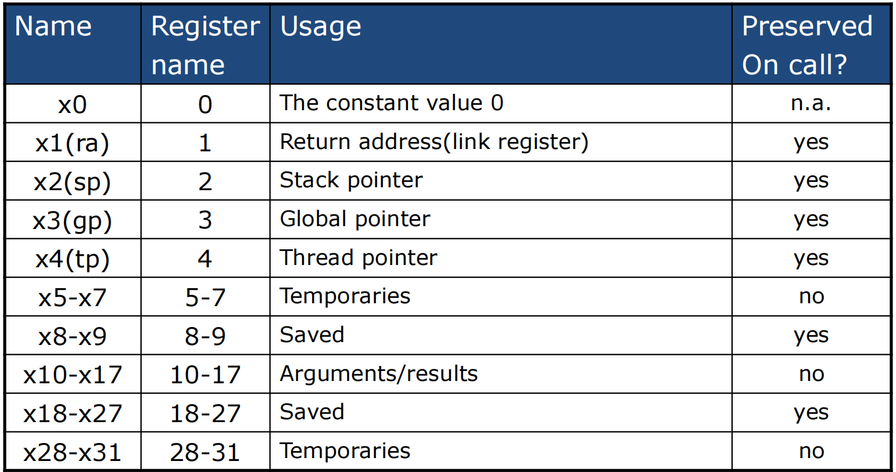
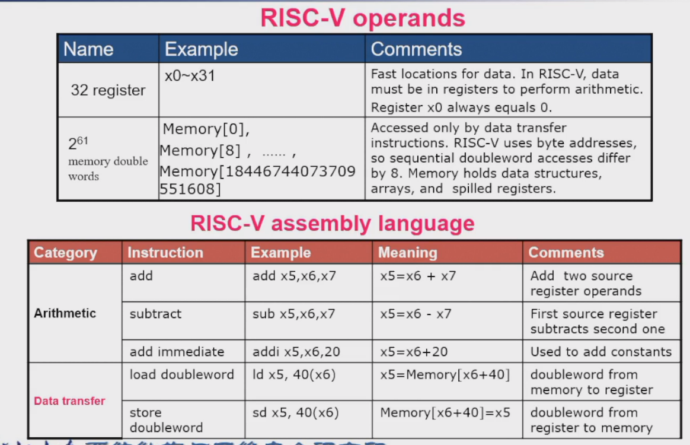

# 第2章 Risc-V ISA
## operation
### arithmetic指令的规则和统一形式
+ 每条指令只能执行1个操作，如add、and、数据存取等
+ Exactly three variables 如`add a,b,c`, a←b+c
## operand
Risc-V的arithmetic指令的操作数必须是register
### Register, Word (4 Bytes)
??? Summary "Risc-V Registers"

    |Name|Register Name|Usage|Preserved or call?|
    |:-|-|-|-|
    |x0 (zero)|0|The constant value 0|n.a.|
    |x1 (ra)|1|Return address(link register)|yes|
    |x2 (sp)|2|Stack pointer|yes|
    |x3 (gp)|3|Global pointer|yes|
    |x4 (tp)|4|Thread pointer|yes|
    |x5-x7 (t0-t2)|5-7|Temporaries|no|
    |x8 (s0/fp)|8|Saved/frame pointer|yes|
    |x9 (s1)|9|Saved|yes|
    |x10-x17 (a0-a7)|10-17|Arguments/results|no|
    |x18-x27 (s2-s11)|18-27|Saved|yes|
    |x28-x31 (t3-t6)|28-31|Temporaries|no|
    |PC|-|Add Upper Immediate to PC|yes|

    

根据教材的硬件设施，有32个64bit的register，memory中的数据以1个doubleword (8Byte = 64bit) 为一个访问单位，每一次访问memory都是访问一个doubleword块，因此访问起始地址为 0, 8, 16, 24...以此类推
### memory operands
+ 主存(main memory)用于存放复杂数据结构
如Arrays, structures, dynamic data
+ 进行算术运算通过
    + Load values from memory into registers
    + Store result from register to memory
+ Memory is byte addressed
Each address identifies an 8-bit byte
+ RISC-V is Little Endian
    + 小端法：Least-significant byte at least address of a word
    + 大端法: most-significant byte at least address
+ RISC-V does not require words to be aligned in memory
words align: 一个字是 4 字节，我们要求字的起始地址一定要是 4 的倍数。

### Registers vs. Memory
+ Registers are faster to access than memory
+ Operating on memory data requires loads and stores
+ Compiler must use registers for variables as much as possible
编译器尽量使用寄存器存变量。只有在寄存器不够用时，才会把不太用的值放回内存。

!!! Summary "Risc-V ISA"
    

!!! example "memory operand example"

    === "C"
    
        ``` c
        A[12] = h + A[8];
        /* assume A is an array of 8Byte elements (a doubleword),
        Base of A is stored in x22, h in x21 */
        ```
    
    === "asm"
    
        ``` asm
        ld x9, 64(x22)
        add x9, x21, x9
        sd x9, 96(x22)
        ```

# Instruction set


## procedure calling（函数调用）
+ sp (stack pointer) : 指向当前的栈顶，在当前进程中不断变化
+ fp (frame pointer) : 指向当前进程的栈底