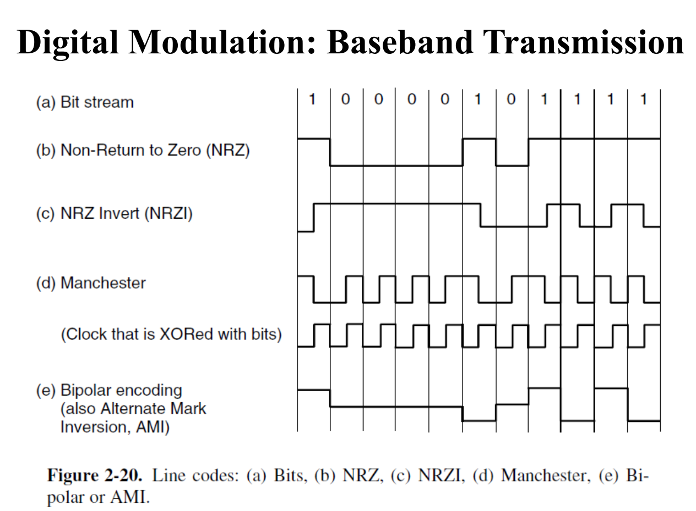

> 考试时间：01月11日(10:30-12:30)

!!! note "助教的建议"
    距离考试还有1个月时间了，建议同学们提早开始准备，也给其他课程的复习留出充分时间因为我们的课程内容量比较大+闭卷，记忆量会有一点大，同学们最好还是要对课程内容充分理解，对各种协议的功能/目的了解清楚后也会更容易快速记住相应的知识点这里整理了一些学长/同学分享的资源，希望对大家学习和复习能有一定的帮助ꔷ 25年王道计算机网络：和我们的课程/题型比较接近，同学们可以做做王道的题目测试知识点掌握情况需要注意的是王道没有网络安全的部分，而这部分在期末考试占一定的比重，一定不要只抱着王道复习而忽略了这些内容我个人经验是快速刷完需要4-5天，如果感觉自己掌握不太好可能需要多留一点时间，这段时间我也会再刷一下25年的王道[忙疯了]ꔷ 笔记

    一位很厉害的学长整理的课程笔记[咸鱼暄学长的计算机网络思维导图](https://www.yuque.com/xianyuxuan/coding/network)很清晰地梳理了课程相关的知识点，文档中还有历次辅学的回放
    
    [求是潮-课程资源共享计划](https://github.com/QSCTech/zju-icicles/tree/master/%E8%AE%A1%E7%AE%97%E6%9C%BA%E7%BD%91%E7%BB%9C/%E8%B5%84%E6%96%99)

    100题比较有用ꔷ 微信群：计网&操作系统急急急学院内同学们自发组织的答疑互助群，期末复习时候讨论会比较方便，因为目前超过200人加入了，如果有同学想要加群需要找已经加群的同学邀请/找我拉你入群同学们复习中对知识点/题目有疑问可以随时钉钉提问/答疑群提问（我也在群里[流鼻血]），我也会把大家遇到比较多的共性问题梳理出来，大家提问时推荐带上来源（比如某份资料的某页某题），这样效率会高一点祝大家期末复习顺利~


MAC layer requires each frame at least 64bytes

root bridge: mac地址最小的交换机

```bash
vlan 2 # create vlan 2
switchport mode access
switchport access vlan 2 # switch to vlan 2

# create sub interface
interface f0/0.1
ip add ... ...
encapsulation dot1q 1 # config subnet to vlan 1
interface f0/0.2
ip add ... ...
encapsulation dot1q 1 # config subnet to vlan 1

interface f0/0
switchport mode trunk # trunk mode for 2 subnets in different subnets 
no shutdown
```

```bash
conf t
ip routing # upgrade 3-layer switch to router
```


## RSA
欧拉函数 $\Phi(N)$ ：小于 $N$ 且与 $N$ 互质的数的个数

性质：
1. $\Phi(a\times b)=\Phi(a)\times\Phi(b)$
2. $m^{\Phi(n)}\equiv 1 \pmod{n}, \ if\ (m,n)=1$

The $\Phi$ of any prime $p$ is $p-1$

$\Phi(N)=\Phi(P_1)\times\Phi(P_2)=(P_1-1)\times(P_2-1)$

public key: n,e
private key: d

## Digital Signature
1. 椭圆曲线参数方程：$y^2=x^3+ax+b$

## Challenge response
### Authentication based on a shared secret key

## DNS Spoofing
在DNS server插入虚假的IP地址，让客户端访问虚假的IP地址，从而获取到信息


# transport layer
+ congestion(sending) window size: 
    能发送的最大数据包，不被包含在tcp header中
+ flow control(receving) window size:
    能接收的最大数据包，被包含在tcp header中

## TCP Reno
1. slow start条件: 
    + 初始化
    + timeout occurs
    + 不包括packet loss
2. slow start措施:  
    + 将slow start threshold设为当前的一半，congestion window size设为1
    + slow start threshold之前，指数增长(exponential increase)
    + slow start threshold之后，线性增长(additive increase)

## TCP Tahoe


# network layer
## OSPF protocol
virtual link: 无法与主干网area0直连的区域，但可以与area0直连的区域通过虚拟链路连接

command: 
```bash
(config)# router ospf 1 # enable ospf [process id]
(config-router)# network x.x.x.x 0.0.0.255 area 0 # 直连网络配置
```

缺省网关都按最高或最低位来选择
### RID (router ID)
一台路由器在自治系统中的唯一标识
一般将回环接口作为RID

### virtual link
虚链接设置在两个路由器之间，这两个路由器均有一个端口与同一个非主干区域连接。虚链接被认为是属于主干区域
command: 
```bash
router ospf 1
area 0 virtual-link RID
```

### OSPF metric
按照cost来计算，而非跳数
Serial cost: 48
Ethernet cost: 10 
FastEthernet cost: 1
GigaEthernet cost: 1


# Hardware
+ twisted pair (telephone)
    + 
    + 
+ coaxial cable (TV)
+ fiber optic cable (the backbone the PSTN, public switched telephone network)
+ radio spectrum (cellphone)

# Software
protocol Hierarchy:
layer1 ------ layer1

------interface-----

layer2 ------ layer2

------interface-----

layer3 ------ layer3

------interface-----

layer4 ------ layer4

------interface-----

layer5 ------ layer5

------interface-----

physical medium

# OSI model
application layer   : 
presentation layer  :
session layer       :
transport layer     : segment ---> end-to-end
network layer       : packet
data link layer     : frame
physical layer      : bit

# TCP/IP model
application layer
transport layer
network layer
link layer

DNS: UDP based

# performance metrics
delay
loss
throughput

# physical layer
Nyquist bandwidth: 
$C=2B\log_2V$ (V: number of levels)

Shannon Capacity:
$C=B\log_2(1+{\rm{SNR}})$

## digital modulation (for baseband signal)
+ bit stream
+ NRZ
+ NRZI
+ Manchester (clock XORed with signal)
+ Bipolar encoding (average tends to 0)



## digital modulation (for passband signal)
ASK
FSK
PSK
## Multiplexing
FDM(frequency division Multiplexing)

TDM(time division Multiplexing)

CDM(code division Multiplexing)
    chip sequence

PSTN
Cellular network
- frequency reuse

# Data link layer
## framing
+ byte count
+ flag bytes with byte stuffing
    ESC+flag (PPP protocol)
+ flag bits with bit stuffing
    5 consecutive "1" followed by 1 "0"
## error detection/correction
Hamming distance vs. Hanmming distance of a complete code
+ To reliably detect d errors, need a distance d+1 code
+ To correct d errors, need a distance 2d+1 code

Hamming codes
$$
(m+r+1) \leq 2^r
$$

+ wireless: use correction
+ wired: use detection and retransmission

### error detection
parity
checksum
CRC (cyclic redundancy check)
pattern P is 1 bit longer than desired FCS

## flow control
sliding window protocol
+ one-bit sliding window
+ go-back-N 
    receive window size : 1

+ selective repeat

# MAC sublayer
## ALOHA
pure ALOHA
slotted ALOHA
## CSMA
1-persistent
Nonpersistent
p-persistent'
CSMA/CD
## Collision free protocol
Bit-Map protocol
token passing
...
...

## Ethernet
+ classical Ethernet: 3-10Mbps
+ 

### Ethernet frame structure
preamble field: for synchronization 

minimum frame size: 64 bytes

transmission time >= RTT

## random interval

Collision --> slot --> after i-th Collision --> randomly choose from 1~2^i-1
--> after 10-th Collision --> frozen 1023 slots

## MACA 
RTS/CTS
802.11 WIFI frame structure

## Bridge 
connecting 2 multidrop LANs
All of the stations attached to the same port belongs to the same collision domain

## repeaters, hubs, bridges, switches, routers, gateways

# Network layer 
## Spanning tree
选择MAC地址最小的作为根节点

## Virtual vlan
ports in each vlan form a broadcast domain
vlan trunk: a special port on each switch configured to interconnect ...


## Routing algorithm
### Link-state
Global routing
Dijkstra 
may have oscillation
### Distance vector
local
count to inifinty problem
### metrics
+ message complexity
+ speed of convergence
+ robustness when 1 router malfunctions

## IP protocol
RIP
OSPF
BGP

## IPv4 Datagram
20-bytes fixed part 
addr length: 32bits

## CIDR 
Classless Inter-Domain Routing
## IPv6
::182.31.20.46 effective IPv6 addr

## IP addr distribution
+ NAT

+ DHCP

## ICMP
ping
trace
ICMP message type

## ARP
map IP addr to MAC addr only for nodes on the same subnet
## DNS
map host name to IP addr anywhere in the world

## RIP
Intra-AS routing
DV algo
metric: hop count
## OSPF
LS algo
metric: bandwidth
## BGP

# Transport layer
segment/TPDU
UDP don't do:
+ flow control
## RTP 

## TCP
multiplex, point-To-point

three-way handshakes
+ SYN: send by client to initiate a connection
+ SYN-ACK: send by server to accept the connection
+ ACK: send by client to confirm the connection

+ FIN: send by client to close the connection
+ RST: send by either side to abort the connection
+ ACK: send by server to confirm the FIN
+ ACK: send by client to confirm the FIN
+ ACK: send by server to confirm the RST
+ ACK: send by client to confirm the RST

### TCP time management
RTO (retransmission timeout)

### Congestion control
...
slow start 
fast recovery

# application layer
DNS, email(SMTP), 

## DNS
type field
...

### DNS resolution
Iterative/recursive query

## FTP
use 2 parallel connections

## email
use SMTP

## Web
http protocol(stateless)
+ cookie
TCP port: 80; HTTPs port: 443
Web caching
HTML
