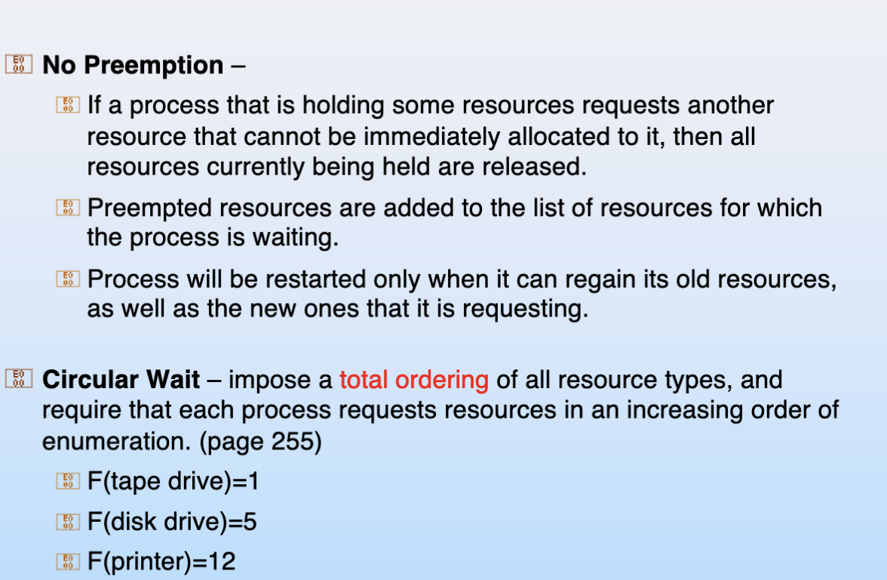
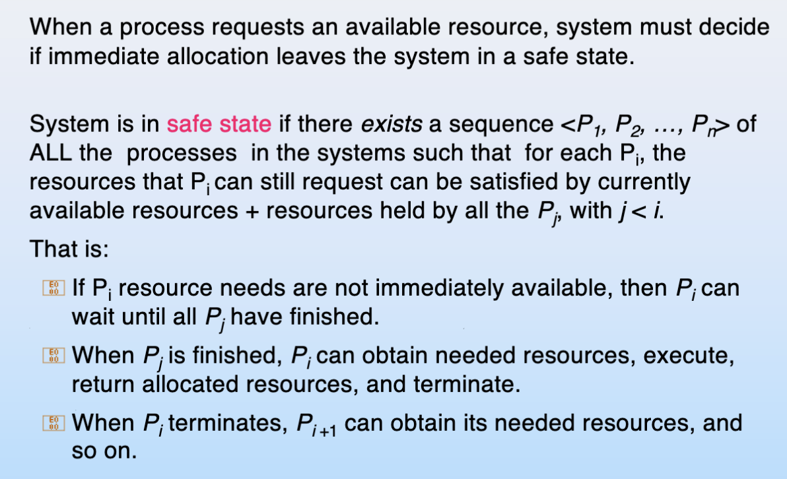

> 考试时间：01月07日(10:30-12:30)

# chap 7 deadlock

## Resource allocation graph


If graph contains a cycle 

+ if only one instance per resource type, then deadlock.

+ if several instances per resource type, possibility of deadlock.

## deadlock handling
+ Ensure that the system will never enter a deadlock state
    + Prevention

    + Avoidance

+ Allow the system to enter a deadlock state and then recover - database

    + Deadlock detection and recovery

+ UNIX: Ignore the problem and pretend that deadlocks never occur in the system;
## deadlock prevention
打破死锁的任一条件




## Deadlock Avoidance
### safe state

If a system is in safe state -> no deadlocks.

If a system is in unsafe state -> possibility of deadlock.

Avoidance is to ensure that a system will never enter an unsafe state. 

### Avoidance algorithms
+ Single instance of a resource type
    Use a resource allocation graph

+ Multiple instances of a resource type
    Use the banker’s algorithm

-------------------------------------

# Chapter 10: basic of file
顺序读写（更快）
随机读写
## Directory structure
A collection of nodes containing (management)  information about all files

+ Single-Level Directory
    A single directory for all users
+ Two-Level Directory
    Separate directory for each user
+ Tree-Structured Directories
+ Acyclic-Graph Directories

## Mount
将disk上的其他文件系统挂载到当前文件系统上
```bash
$ mount /dev/dsk /users
```

## Access Lists and Groups
Three classes of users
+ owner
+ group
+ public

对于elf文件，必须具有x权限，才能执行；
对于目录，必须具有读写权限，才能搜索；

# Chapter 11: File System Implementation
## Data structure
### Disk structure
### In-memory structure
两个进程打开一个文件，有几个进程文件打开表，几个全局文件打开表
一个进程打开一个文件两次，有几个进程文件打开表，几个全局文件打开表

## Virtual File System
虚拟文件系统是不是一个文件系统？是。

## Allocation method
### Contiguous allocation
    Extent-based Allocation
### Linked allocation
Simple-need only starting address
Free-space management system 
no waste of space 
No random access, poor reliability
Mapping
### Indexed allocation

## Dentry and Inode
## Free-Space Management

# Chapter 12: Mass Storage System 
seek time (moving arms to position disk head on track)
rotational delay (waiting for block to rotate under head)
transfer time (actually moving data to/from disk surface)

## Disk scheduling

### SCAN (elevator) Algorithm

### C-SCAN (with look)

## RAID (redundant arrays of inexpensive disks)
### Disk striping
Bit-level Striping
Block-level Striping: different blocks of a file are striped
+ RAID-0
    1. No redundancy
+ RAID-1
    1. Mirroring
    2. 50% utilization
+ RAID-2
    ecc
+ RAID-3
    1. bit-interleaved parity
+ RAID-4
    1. block-interleaved parity
+ RAID-5
+ RAID-6

# Chapter 13: I/O Systems

## Signal and Interrupt
## Direct Memory Access