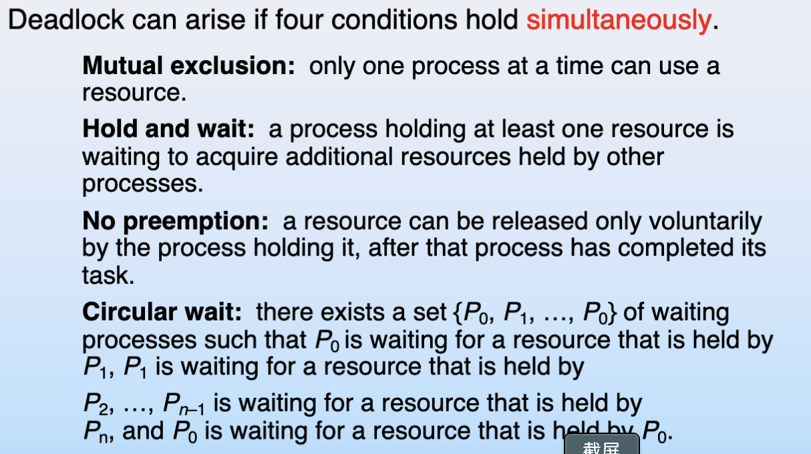

> 考试时间：01月07日(10:30-12:30)

# chap 7 deadlock

## Resource allocation graph

If graph contains a cycle 

+ if only one instance per resource type, then deadlock.

+ if several instances per resource type, possibility of deadlock.

## deadlock handling
+ Ensure that the system will never enter a deadlock state
    + Prevention

    + Avoidance

+ Allow the system to enter a deadlock state and then recover - database

    + Deadlock detection and recovery

+ UNIX: Ignore the problem and pretend that deadlocks never occur in the system;
## deadlock prevention
打破死锁的任一条件

## Deadlock Avoidance
### safe state

If a system is in safe state -> no deadlocks.

If a system is in unsafe state -> possibility of deadlock.

Avoidance is to ensure that a system will never enter an unsafe state. 

### Avoidance algorithms
+ Single instance of a resource type
    Use a resource allocation graph

+ Multiple instances of a resource type
    Use the banker’s algorithm