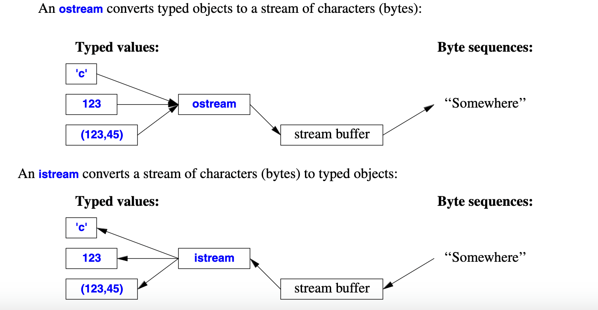

# OOP笔记
## I/O streams
istream和ostream的图示

### operators
The operator `<<` is used as an output operator on objects of type `ostream`;
The operator `>>` is used as an input operator determines what input is accepted and what is the target of the input operation;
#### `>>`的读入规则
若读入类型为integer，则读入终止于非digit字符；若读入string，则终止于空格或回车
> 也可以用如`getline(cin,str)`来读入一整行，并抛弃掉末尾的newline

### IO state
`int i; while(cin >> i);`会读入i直到读入失败为止，彼时`cin >> i`会return false，而且`cin.fail()`会return true，表明istream无法读取下一个；此时可以通过`cin.clear()`来重新设置istream的状态

### I/O of User-Defined Types
例子：
```C
struct Entry {
    string name;
    int number;
};

ostream& operator<<(ostream& os, const Entry& e)
{
    return os << "{\"" << e.name << "\", " << e.number << "}";
}

istream& operator>>(istream& is, Entry& e)
// read { "name" , number } pair. Note: for matted with { " " , and }
{
    char c, c2;
    if (is>>c && c=='{' && is>>c2 && c2=='"') { // star t with a { "
        string name; // the default value of a string is the empty string: ""
        while (is.get(c) && c!='"') // anything before a " is part of the name
        name+=c;
        if (is>>c && c==',') {
            int number = 0;
            if (is>>number>>c && c=='}') { // read the number and a }
                e = {name ,number}; // assign to the entry
                return is;
            }
        }
    }
    is.state_base::failbit; // register the failure in the stream
    return is;
}
```
### Formatting
最简单的formatting controls是manipulators，在<ios>, <istream>, <ostream>和 <iomanip> (for manipulators that take arguments)中
+ 例子：
```C
cout << 1234 << ',' << hex << 1234 << ',' << oct << 1234 << '\n'; 
// print 1234,4d2,2322

constexpr double d = 123.456;
cout << d << "; " // use the default
<< scientific << d << "; " // use 1.123e2 style 
<< hexfloat << d << "; " // use hexadecimal notation 
<< fixed << d << "; " // use 123.456 style
<< defaultfloat << d << '\n'; // use the default

// C++ uses rounding instead of truncating
cout.precision(8);
cout << 1234.56789 << ' ' << 1234.56789 << ' ' << 123456 << '\n';
// 1234.5679 1234.5679 123456

cout.precision(4);
cout << 1234.56789 << ' ' << 1234.56789 << ' ' << 123456 << '\n';
// 1235 1235 123456
```

### File stream
In `<fstream>`, the standard library provides streams to and from a file:
+ `ifstream` for reading from a file
+ `ofstream` for writing to a file
+ `fstream` for reading from and writing to a file

```C
ofstream ofs("target"); // ‘‘o’’ for ‘‘output’’
if (!ofs) error("couldn't open 'target' for writing");

fstream ifs; // ‘‘i’’ for ‘‘input’’
if (!ifs) error("couldn't open 'source' for reading");
```

### String stream
In `<sstream>`, the standard library provides streams to and from a string:
+ `istringstream` for reading from a string
+ `ostringstream` for writing to a string
+ `stringstream` for reading from and writing to a string.
...不清楚怎么用yet


## The vector
用时需要`#include <vector>`
### 基本规则和操作
```C
vector<class T> amounts; 
//vector<type> name;
amounts.empty(); 
// return true if amounts is empty
amounts.size();
amounts.clear();
// empty amounts
amounts.push_back(const T& elem);
/* append to amounts. 
if elem is a direct object instead of a pointer,
makes a deep, independent copy of that object. */
amounts.pop_back();
amounts[2];
// access using operator[]

// iterator
amounts.begin();
amounts.end();
amounts.erase(iterator where);
/* remove element addressed by where
and return an iterator pointing to the elements
after the removed one*/
```

> Changes to a vector invalidate all existing iterators. As a result, previously generated iterators could reference meaningless data.

## The map
### 基本规则和操作
```C
pair<iterator, bool> insert(const pair<Key, Value>& newEntry);
/* if Key already exists in map, return (an iterator addressing 
the pair stored inside the map on behalf of the key, false);
Otherwise return (..., true), and insert the (key, value) pair 
into the map;
*/
iterator find(const Key& key);
// ...
```
## Inline functions
### 原理
区别于正常函数与主程序分开存放，inline函数在调用时将它的definition，即运行代码贴在调用处。这样就避免了正常函数调用时需要存储返回地址和instruction pointer跳转等操作带来的时间消耗。
但这也同时导致了使用inline函数会是程序更长，属于用大空间换短时间。
### 适用范围
也正是由于这个特性，某些函数不适合用inline：
1. 函数本身的运行时间远大于调用所需时间
因为这样调用节省的时间忽略不计，白白浪费空间
2. 函数并没有被频繁调用
这样就没有发挥出inline的用处
### 使用方法
在声明或定义函数时增加前缀`inline`即可，如`inline double square(double x) { return x * x; }`
> compiler未必会满足inline的需求；如果该函数太大，或recursive，inline都会被忽略，当作正常函数

## Reference
+ 规则：必须在声明reference变量时初始化，和某变量绑定（成为其别名），不可二次绑定