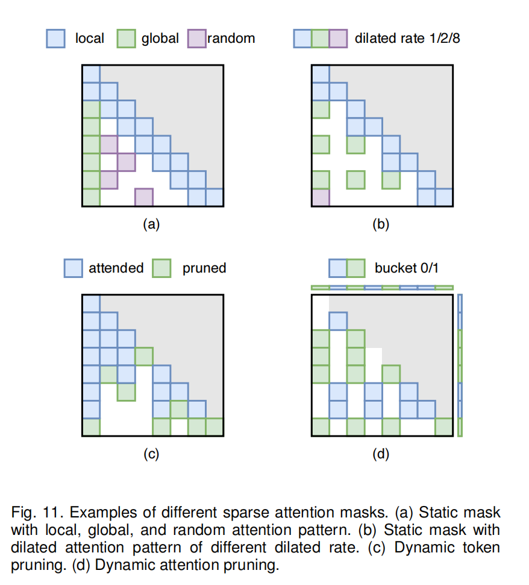

主要围绕"A Survey on Efficient Inference for Large Language Models"这篇文章展开，另一篇关于multimodal language model的survey还没有开始看。。。

这两周主要熟悉了transformer的原理，以及从data、model和system从层面对LLM的各种优化方法。

# Transformer ("Attention Is All You Need")
对于transformer，目前比较困惑的点是每一个layer内部如何处理输入的token和positional encodings，包括attention layer和FFN layer。

特别是attention layer的Q、K、V矩阵，分别是query、key、value的缩写，它们和input prompt之间是什么关系？query和key向量是如何由input prompt得到的？

最重要的是，既然都是采用Auto-Regressive的方法，为什么transformer相较于RNN的并行性好很多，也就是positional encoding的优势体现在哪里？

## KV cache
为了节省频繁出现的token的计算时间，引入了KV cache存储这些token的key和value。KV cache出现在层与层之间，在prefilling阶段存储input token的K、V值，在decoding阶段generation时进行更新。

## planning
目前思路是，由于每个layer内部都是基于神经网络的基本原理，所以可以考虑先看看cs231n的lecture notes了解一下（一周之内），然后再精读attention is all you need这篇文章。

# Survey on Efficient LLMs
目前大致了解了data-optimization和model-optimization，system level的还没细看。

## data-level
主要通过input compression和output organization来优化。

其中input compression通过各种计算方式，将input中不重要的token进行pruning；或者summarize input；或者是RAG(Retrieval-Augmented Generation)，即通过调用外部知识库来进行答案生成

而output organization则是观察到传统的generation是token by token线性的，因此希望通过parallelize generation来加速。根据这个现象，很多方法采用了SoT的思想，通过分析得到没有dependency的output token（关键词），然后以这些token为骨架进行并行生成

这个方面，咱们lab应该做的不多？我在想是不是可以先跳过这部分的reference paper不看

## model-level
这个层面的优化主要有model arch的优化，以及data representation的优化。

### model arch/structure
这个方向根据transformer的组成部件，主要分为efficient FFN和efficient Attention
#### efficient FFN
目前看来用的方法都是MoE(Mixture of Expert)化，之前看到在ZIP lab群里面好像有提及。

具体而言，引入多个FFN，也即多个expert，在这种transformer中，通过routing module的控制，每次只会activate某些expert

#### efficient Attention
##### Multi-Query Attention (MQA)
在不同的attention head之间共享KV cache

进一步有Grouped-query attention(GQA)，先将attention head分为多组，每一组attention heads公用KV cache

##### Low-Complexity Attention
原来的attention layer计算公式为

$$
{\rm {Softmax}} (QK^T)V,\ \ Q,K,V \in \R^{n \times d}
$$

其中n为input sequence length，d为model dimension

于是该公式的计算就需要 $O(n^2d)$ 复杂度。此类方法则通过各种projection(linear...)得到更小的矩阵，将此计算近似，得到 $O(n)$ 复杂度

+ Kernel-based Attention

$$
{\rm {Softmax}} (QK^T)V \approx \phi(Q)(\phi(K)^TV) \ \ ,\phi(Q),\phi(V) \in \R^{n \times d}
$$

其中 $\phi$ 函数有很多版本

+ Low-Rank Attention

将context matrix，即K, V matrix通过linear projection变成

$$
X \in \R^{n \times d} \rightarrow X' \in \R^{k \times d}
$$

其中X为K或V矩阵

#### Transformer Alternates
目前没有仔细看reference paper，但我认为都是基于 HiPPO 这篇论文，以及SSM(State Space Model)的sequence modeling。

目前很有名的 Mamba 好像就是这个领域的工作。

### data representation
这个我觉得比较好理解，最常用的量化(quantization)方法就是将LLM的亿万级规模参数的精度降低，从而节省存储空间和计算时间。但实际上，量化的方法非常多，很多都非常detail，甚至需要我没学过一些线性代数的知识。

####

问题：

+ Q1 
    之前只是浏览了一下LLaVA的github仓库，由于没接触过，有点无从下手，打算接下来请教一下学长该怎么跑代码。但是还是想问一下老师，为什么要跑这两个大模型的代码？是需要理解它们的源代码吗，还是通过调参来测试性能？

+ Q2
    这一篇survey里就有300+的reference papers，有没有比较好的方法筛选需要细看的paper呢。比如citation，有没有方便点的方法看一篇paper的citation？

+ Q3
    这几天看下来，感觉能做的东西好多，而且要学的东西也很多。所以感觉有点迷茫。。。

Specifically, we focus on two widely-used large language models (LLMs), LLaMA-2-7B and LLaMA-2-13B, and quantize their weights to 4-bit using the AWQ [194] algorithm. Subsequently, we deploy these quantized models on a single NVIDIA A100 GPU using two different inference
frameworks: TensorRT-LLM [222] and LMDeploy [223].

为什么在prefilling阶段的主要latent来自于GEMM computation，而在decoding阶段的latent主要来自于weight loading？

LLM分为train和inference两个阶段，inference阶段我就直观理解为输入prompt，由LLM回答；train阶段，根据文献，有很多方式，比如KD、ICL、CoT，这些都是通过supervised learning来进行训练的吗？

主要看了KD(knowledge distillation)方法，我觉得soft probability distribution是最核心的观点，因为这种训练的信息量更大，可以让student更好的学习teacher的representation。但是这是为什么呢？

It would clearly be better to train models to generalize well, but this requires information about the correct way to generalize and this information is not normally available. When we are distilling the knowledge from a large model into a small one, however, we can train the small model to generalize in the same way as the large model. If the cumbersome model generalizes well because, for example, it is the average of a large ensemble of different models, a small model trained to generalize in the same way will typically do much better on test data than a small model that is trained in the normal way on the same training set as was used to train the ensemble.

When the cumbersome model is a large ensemble of simpler models, we can use an arithmetic or geometric mean of their individual predictive distributions as the soft targets. When the soft targets have high entropy, they provide much more information per training case than hard targets and much less variance in the gradient between training cases, so the small model can often be trained on much less data than the original cumbersome model and using a much higher learning rate.

In the simplest form of distillation, knowledge is transferred to the distilled model by training it on a transfer set and using a soft target distribution for each case in the transfer set that is produced by using the cumbersome model with a high temperature in its softmax. The same high temperature is used when training the distilled model, but after it has been trained it uses a temperature of 1