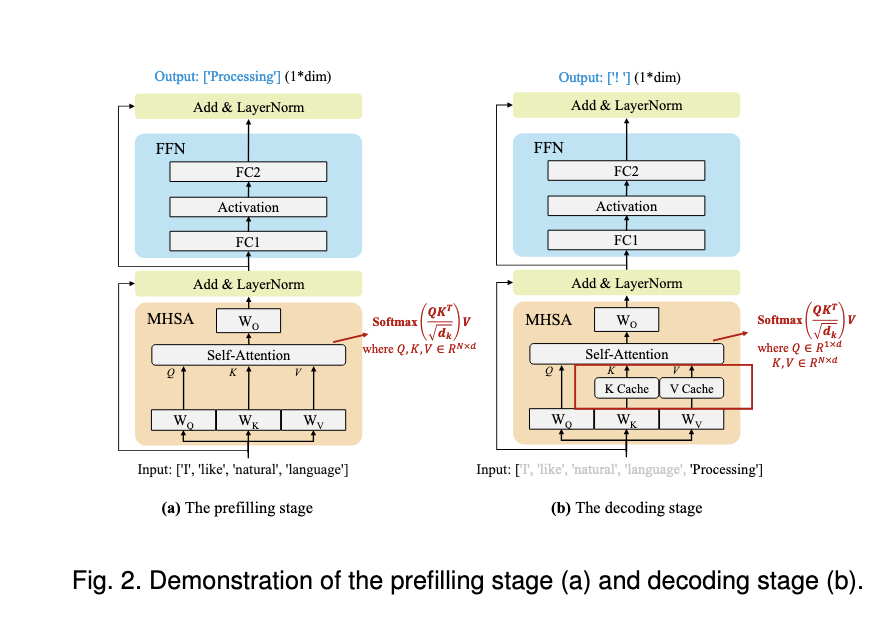
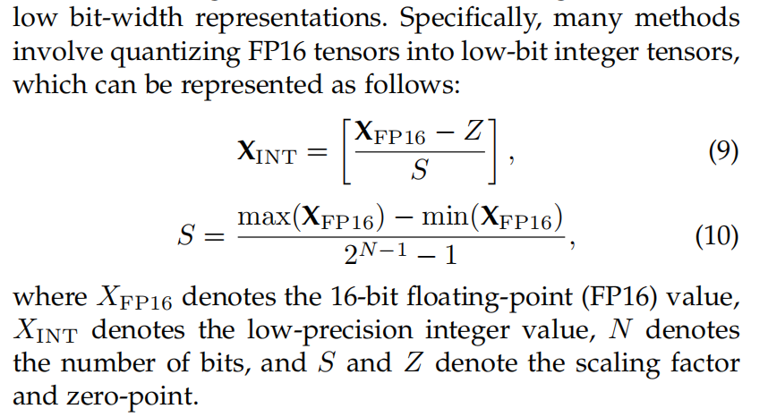
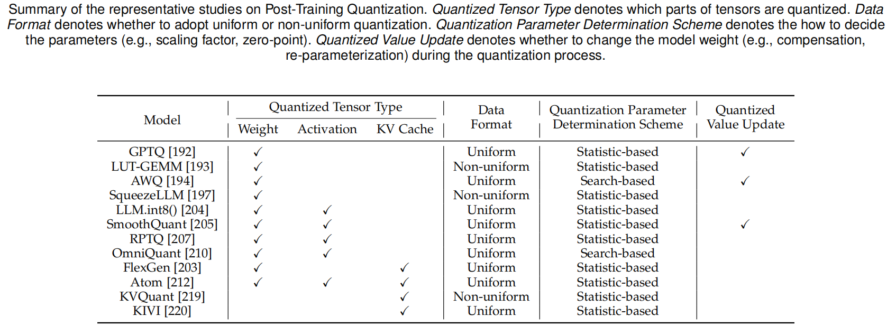
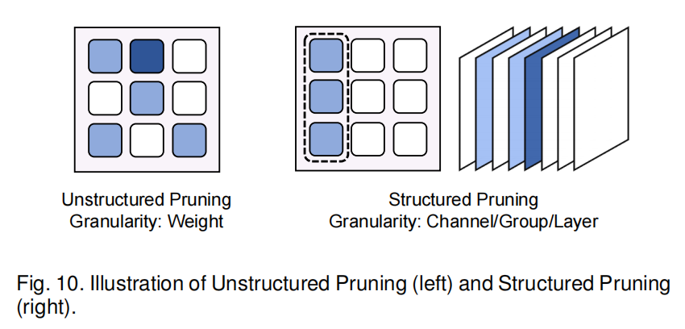

Efficient Inference for LLMs

文章总结了近年来从3个层面对大语言模型进行优化/加速的各种方法

# 一些前置知识
## Transformer架构
transformer架构由若干transformer block组成，每个block又由以下三个部件构成

+ a Multi-Head Self-Attention (MHSA) block
+ a Feed Forward Net-work (FFN)
+ a LayerNorm (LN) operation

For each block, it receives the output features of the previous one as the input, and passes the features through each sub-module to obtain the output. 

特别地，在第一个block之前，a tokenizer用来将original input sentence转变成a sequence of tokens，然后a following embedding layer用来将the tokens 转变成the input features。然后，the additional position embeddings are added into the input features to encode the sequential order of each input token.

Transformer架构的核心在于self-attention mechanism，其中具体的内部处理过程如下：（暂时省略）

## Inference Process of LLMs
最常用的LLM采用auto-regressive method(AR)来生成输出句子。AR的机制是generate tokens one by one，在每一个token generation step，LLM takes as input the whole token sequences, including the input tokens and previously generated tokens, and generates the next token.

因此，随着sequence length的增加，generation的时间也会迅速增长。为了解决这个问题，引进一种方法key-value(KV) cache来加速generation。KV cache的作用是storing and reusing previous key (K) and value (V) pairs within the Multi-Head Self-Attention (MHSA) block.

基于KV cache的设计，LLM的inference process可以划分为2个阶段，见下图：

+ Prefilling Stage: 

    The LLM calculates and stores the KV cache of the **initial** input tokens, and generates the first output token
    
+ Decoding Stage: 

    The LLM generates the output tokens one by one with the KV cache, and then updates it with the key (K) and value (V) pairs of the newly generated token

## Critical efficiency indicators
+ latency
    1. first token latency
    2. per-output token latency
    3. generation latency

+ model size

+ throughput
    1. token throughput
    2. request throughput

整个inference的过程如下图：

??? note "inference"
    

## Efficiency analysis
在resource-constrained的场景下部署LLMs，同时要保证他们的性能是一个挑战，除了存储和时延之外，还要考虑功耗、吞吐量等。对于上述的三个指标，有三个最重要的影响因素：

+ computational cost
+ the memory access cost 
+ the memory usage

接下来基于这三个影响因素提出三个inefficiency的root causes

+ Model Size:
+ Attention Operation:
+ Decoding Approach:

根据上述的factors和causes，作者对当今的inference optimizaion方法进行了分类，即：

+ Data level optimization
+ model level optimization
+ system level optimization

接下来分别详细介绍各个level的优化方法

# Data level optimization
可以进一步分为 

+ input compression

    directly shorten the model input to reduce the inference cost

+ output organization

    enable batch (parallel) inference via organizing the structure of output content, which can improve the hardware utilization and reduce the generation latency.

## Input Compression

#  model-level OPTIMIZATION

## Efficient Structure Design
need re-training from scratch

### Efficient FFN Design

### Efficient Attention Design

### Transformer Alternates

## Model compression

### Quantization

#### Post-Training Quantization (PTQ)

quantizing pre-trained models without the need for retraining

well-explored for smaller models, but applying directly to LLMs presents challenges. 

This is primarily because

+ weights and activations of LLMs often exhibit more outliers

+ and have a wider distribution range compared to smaller models

+ weight-only quantization
    + [GPTQ](https://arxiv.org/pdf/2210.17323)
    + [AWQ](https://arxiv.org/pdf/2306.00978)
    + [SpQR](https://arxiv.org/pdf/2306.03078)
    + [SqueezeLLM](https://arxiv.org/pdf/2306.07629)

        weight outliers are identified and allocated higher precision during quantization
        
    + [QuIP](https://arxiv.org/pdf/2307.13304)
    + [QuaRot](https://arxiv.org/pdf/2404.00456)/[SpinQuant](https://arxiv.org/pdf/2405.16406)
        
        follows the computational invariance idea, by multiplying rotation matrices to the weight matrices and activation matrices
    
+ weight-activation quantization
    + [ZeroQuant](https://arxiv.org/pdf/2206.01861)
    + [SmoothQuant](https://arxiv.org/pdf/2211.10438)
    + [RPTQ](https://arxiv.org/pdf/2304.01089)
        
        reorganizes channels with similar activation distributions into clusters and independently applies quantization within each cluster

    + [Omniquant](https://arxiv.org/pdf/2308.13137)
        
        it optimizes the boundaries for weight clipping and the scaling factor for equivalent transformation to minimize quantization errors

    + [Atom](https://arxiv.org/pdf/2310.19102)
    + [BiLLM](https://arxiv.org/pdf/2402.04291)
        
        BiLLM identified the bell-shaped distribution of weights and the exceptionally long-tail distribution of weights’ Hessian matrix. 
        
        Based on this, it proposes to categorize weights into salient and non-salient values structurally based on the Hessian matrix and binarizes them separately

#### Quantization-Aware Training (QAT)
quantization within the model training procedure

+ reduce the data requirements

+ reduce the computation cost

    parameter-efficient tuning (PEFT)

    + [QLoRA](https://arxiv.org/pdf/2305.14314)
        
        quantizes the weights of LLMs into 4-bit, and subsequently employs LoRA in BF16 for each 4-bit weight matrix to fine-tune the quantized model.

### Sparsification

a compression technique that increases the
proportion of zero-valued elements in data structures such as model parameters or activations. 

This method aims to decrease computational complexity and memory usage by efficiently ignoring zero elements during computation.

#### Weight Pruning
removes less critical weights and structures from models。

+ unstructured pruning
    + [SparseGPT](https://arxiv.org/pdf/2301.00774)
        
        It follows the idea of OBS [225], which considers the impact of removing each weight on the network’s reconstruction loss.
    
    + [Sheared LLaMA](https://arxiv.org/pdf/2310.06694)
    + [LoRA](https://arxiv.org/pdf/2106.09685)

#### Sparse Attention
in **Multi-Head Self-Attention (MHSA)** components of transformer models.

strategically omit certain attention calculations to enhance computational efficiency of the attention operation.

mainly in the **prefilling stage**.

These mechanisms diverge into **static** and **dynamic** categories based on their reliance on specific input data

+ static
    + [Sparse Transformer](https://arxiv.org/pdf/1904.10509)
    + [StreamingLLM](https://arxiv.org/pdf/2309.17453)
        
        applies the local pattern, along with the global pattern only for the first few tokens. 

        It shows that such a global pattern serves as the attention sink to keep the strong attention scores toward initial tokens. 
        
        It helps the LLMs to generalize to infinite input sequence
        length.

+ dynamic
    + [Spatten](https://arxiv.org/pdf/2012.09852)
        
        assesses the cumulative importance of each word by aggregating the attention matrix columns, subsequently pruning tokens with minimal cumulative significance from the input in subsequent layers.

    + [SeqBoat](https://arxiv.org/pdf/2306.11197)
        
        trains a linear State Space Model (SSM) with a sparse sigmoid function to determine which token to prune for each attention head

    + [Adaptively Sparse Attention](https://arxiv.org/pdf/2305.15805)
        
        gradually prunes the tokens during the generation process. It drops parts of the context that are no longer required for future generation

------

### Knowledge distillation

Knowledge Distillation: A Survey

#### response-based knowledge distillation
the student model learns to mimic the predictions of the teacher model by minimizing the difference between predicted outputs. During the distillation process, the teacher model generates soft labels, which are probability distributions over the classes, for each input example. The student model is then trained to predict the same soft labels as the teacher model by minimizing a loss function that measures the difference between their predicted outputs.

Additionally, response-based distillation can significantly reduce the computational requirements of operating a model by compressing it into a smaller and simpler one.

However, response-based knowledge distillation has its limitations. For example, this technique only transfers knowledge related to the teacher model's predicted outputs and does not capture the internal representations learned by the teacher model. Therefore, it may not be suitable for tasks that require more complex decision-making or feature extraction.

#### feature-based knowledge distillation
During the distillation process, the teacher model is first trained on the training data to learn the task-specific features that are relevant to the task at hand. The student model is then trained to learn the same features by minimizing the distance between the features learned by the teacher model and those learned by the student model. This is typically done using a loss function that measures the distance between the representations learned by the teacher and student models, such as the mean squared error or the Kullback-Leibler divergence.

However, feature-based knowledge distillation has its limitations. This technique can be more computationally expensive than other types of knowledge distillation, as it requires extracting the internal representations from the teacher model at each iteration. Additionally, a feature-based approach may not be suitable for tasks where the teacher model's internal representations are not transferable or relevant to the student model.

#### relation-based knowledge distillation
a student model is trained to learn a relationship between the input examples and the output labels. 

First, the teacher model generates a set of relationship matrices or tensors that capture the dependencies between the input examples and the output labels. The student model is then trained to learn the same relationship matrices or tensors by minimizing a loss function that measures the difference between the relationship matrices or tensors predicted by the student model and those generated by the teacher model.

One of the main advantages of relation-based knowledge distillation is that it can help the student model learn a more robust and generalizable relationship between the input examples and output labels than it would be able to learn from scratch. This is because the teacher model has already learned the most relevant relationships between the inputs and outputs from the data, which can be transferred to the student model through the distillation process.

However, generating the relationship matrices or tensors, especially for large datasets, can be computationally expensive. Additionally, a relation-based technique may not be suitable for tasks where the relationships between the input examples and the output labels are not well-defined or difficult to encode into a set of matrices or tensors.

## reference paper for reading

### Efficient FFN Design

+ [98] N. Shazeer, A. Mirhoseini, K. Maziarz, A. Davis, Q. Le, G. Hinton,and J. Dean, “Outrageously large neural networks: The sparsely-gated mixture-of-experts layer,” in International Conference on Learning Representations, 2016.

+ [89] Z. Zhang, Y. Lin, Z. Liu, P. Li, M. Sun, and J. Zhou, “Moefication: Transformer feed-forward layers are mixtures of experts,” in Findings of the Association for Computational Linguistics: ACL 2022, 2022, pp. 877–890.

+ [84] A. Katharopoulos, A. Vyas, N. Pappas, and F. Fleuret, “Transformers are rnns: Fast autoregressive transformers with linear attention,” in International conference on machine learning. PMLR, 2020, pp. 5156–5165.

-------

# Multimodal LLMs
