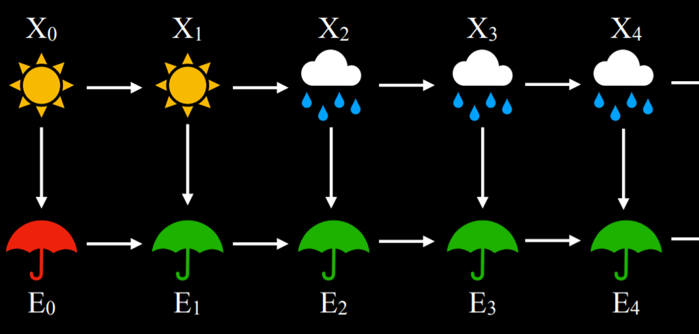

## Uncertainty
### Probability Rules
+ Negation: P(¬a) = 1 - P(a)
+ Inclusion-Exclusion: P(a ∨ b) = P(a) + P(b) - P(a ∧ b)
+ Marginalization: P(a) = P(a, b) + P(a, ¬b)
### Bayesian Networks 贝叶斯网络
Bayesian Networks是一种表示随机变量间依赖关系的数据结构。有如下成分：
+ They are directed graphs.
+ Each node on the graph represent a random variable.
+ An arrow from X to Y represents that X is a parent of Y. That is, the probability distribution of Y depends on the value of X.
+ Each node X has probability distribution P(X | Parents(X)).
#### Inference based on probabilities
Inference有如下成分：
+ Query X: the variable for which we want to compute the probability distribution.
+ Evidence variables E: one or more variables that have been observed for event e. For example, we might have observed that there is light rain, and this observation helps us compute the probability that the train is delayed.
+ Hidden variables Y: variables that aren’t the query and also haven’t been observed. For example, standing at the train station, we can observe whether there is rain, but we can’t know if there is maintenance on the track further down the road. Thus, Maintenance would be a hidden variable in this situation.
+ The goal: calculate P(X | e). For example, compute the probability distribution of the Train variable (the query) based on the evidence e that we know there is light rain.

为了进行inference，我们有2种方法：
+ inference by enumeration (exact infer)
通过已知变量的概率分布，以及与query变量的依赖关系，通过marginalization和conditioning求出query变量的概率分布
+ sampling (approximate infer)
通过采样，按照topological order，对每一个随机变量(node)依次采样，采样某node时，根据其parent的采样值，在这些采样值对应的概率分布下对node采样。得到所有node的采样值时，一次sampling完毕

#### likelihood weighting
采样时若样本的evidence variable值与观察值不匹配，则需丢弃此样本，较为低效。可以通过likelihood weighting来优化：
+ 固定evidence值匹配
+ 对非evidence变量进行采样
+ 对该样本赋权重
> 赋权重的过程：Now that this sample exists, we weight it by the conditional probability of the observed variable given its sampled parents. That is, if we sampled Rain and got light, and then we sampled Maintenance and got yes, then we will weight this sample by P(Train = on time | light, yes).

### Markov Models
#### The Markov Assumption
假设内容：the current state depends on only a finite fixed number of previous states. 
#### Markov chain
A Markov chain is a sequence of random variables where the distribution of each variable follows the Markov assumption. That is, each event in the chain occurs based on the probability of the event before it.

### Hidden Markov Models
与Markov models相比，AI has some measurement of the world but no access to the precise state of the world. In these cases, the state of the world is called the **hidden state** and whatever data the AI has access to are the **observations**.
> 举个例子，在语音识别中，hidden state就是人说的话，而observation就是接收到的声波信号。AI有概率将observation正确的识别为hidden state

#### Sensor Markov Assumption
假设内容：the evidence variable depends only on the corresponding state
#### representation
A hidden Markov model can be represented in a Markov chain with two layers. The top layer, variable X, stands for the hidden state. The bottom layer, variable E, stands for the evidence, the observations that we have.

基于隐式markov model，可以实现：
+ Filtering: given observations from start until now, calculate the probability distribution for the current state. （计算当前状态概率）
+ Prediction: given observations from start until now, calculate the probability distribution for a future state.（计算未来状态概率）
+ Smoothing: given observations from start until now, calculate the probability distribution for a past state.（计算过去某状态发生的概率）
+ Most likely explanation: given observations from start until now, calculate most likely sequence of events.（推测最可能发生的一系列事件）